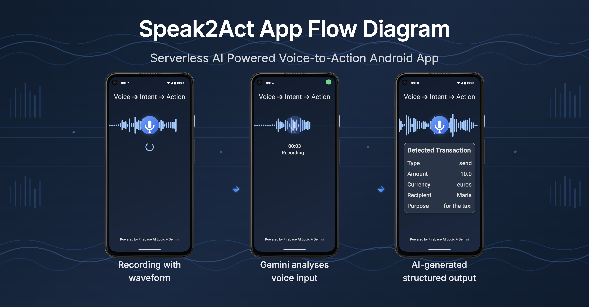
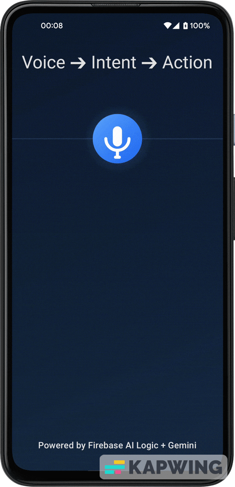
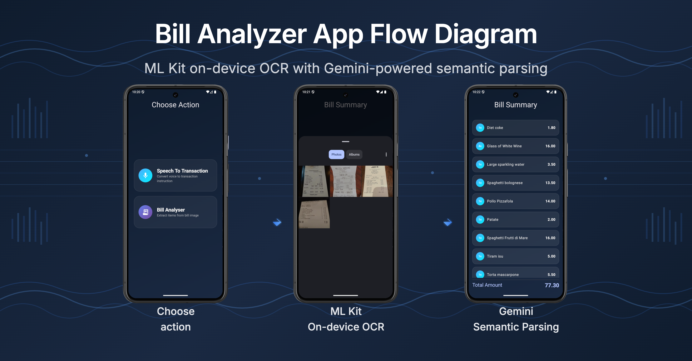
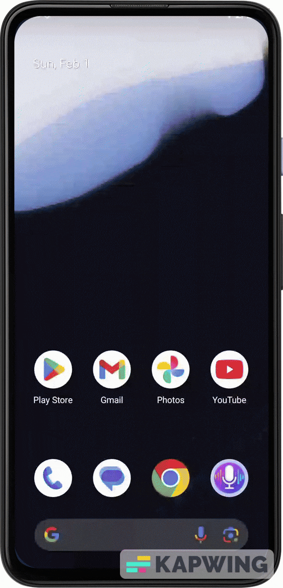
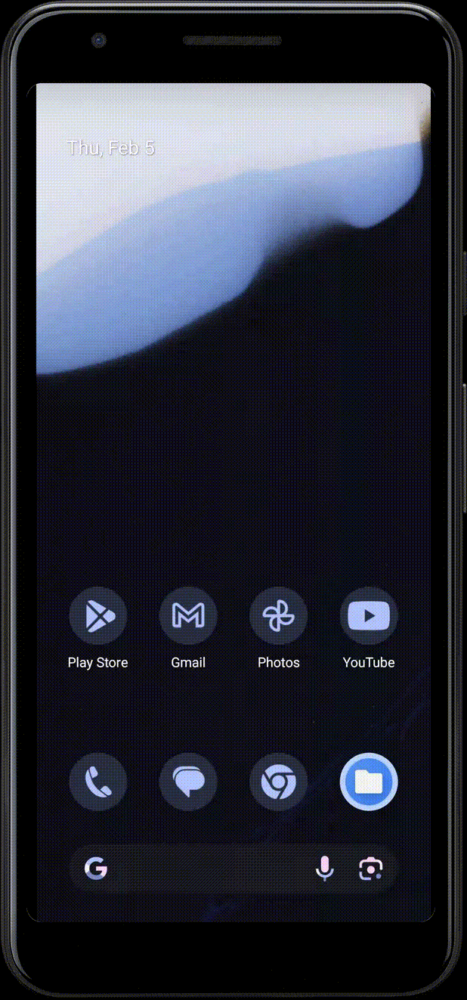

# Speak2Act

Android app showcasing **on-device and cloud-based AI workflows** using **Firebase AI Logic (Gemini)** to transform raw user input (voice or images) into **structured, actionable data**.  
It demonstrates how **voice input** and **on-device OCR** can be combined with **LLM-powered reasoning** to build intelligent, low-latency mobile experiences.

---

## Why this exists

This project serves as a **practical reference** for Android developers exploring:  
- Voice-driven workflows  
- On-device text recognition  
- Firebase AI Logic with **Gemini models**  
- Structured AI output for real-world mobile applications

---

## What it does

- Records user speech and/or captures bill images  
- Transcribes and summarizes intent or OCR text  
- Extracts structured transaction or bill data  
- Returns AI-generated instructions ready for further processing (payments, bill splitting, etc.)

---

## How it works

**Unified flow: Input → AI → Structured Output**

1. **Input:** Speech or image  
2. **On-device processing:** Audio waveform / OCR text extraction  
3. **Cloud AI:** Firebase AI Logic & Gemini reasoning  
4. **Output:** Structured data used in the app

---

## Features

### 🎙️ Speak2Act – Voice to Structured Transactions

  
<table cellpadding="0" cellspacing="0">
<tr>
<td valign="top">

<h3>Pipeline:</h3>

<b>User speaks</b> a natural-language command 
<i>“Request 10 euros from Marija for the taxi bill.”</i>

<b>Audio is recorded</b> on the device:

<ul>
  <li>Live waveform visualization</li>
  <li>Permission-aware recording</li>
</ul>

<b>Audio is sent to Firebase AI Logic:</b>

<ul>
  <li>Gemini processes speech</li>
  <li>Intent is summarized</li>
  <li>Parameters extracted via structured output</li>
</ul>

<b>Structured result is returned:</b>

<ul>
  <li>Action: Request money</li>
  <li>Amount: 10.00</li>
  <li>Currency: Euro</li>
  <li>Recipient: Marija</li>
  <li>Purpose: Taxi bill</li>
</ul>

</td>
<td width="50">&nbsp;</td> <!-- horizontal spacing -->
<td valign="top">
 

</td>
</tr>
</table>

**Technologies**
- Android Media APIs (Audio Recording)  
- Firebase AI Logic  
- Gemini models (speech understanding & reasoning)  
- Coroutines & Flow  
- Jetpack Compose (UI & animations)  

---

### 🧾 Bill Analyzer – Image to Structured Bill Data

<table cellpadding="0" cellspacing="0">
<tr>
<td valign="top">

<h3>Pipeline:</h3>

<b>User selects</b> a bill image from phone's gallery

<b>On-device OCR</b> extracts raw text using <i>ML Kit</i>

<b>OCR output is sent to <i>Firebase AI Logic</i>:</b>

<ul>
  <li>Gemini converts text into structured JSON</li>
</ul>

<b>Structured data is rendered</b> in the app:

<ul>
  <li>Items with quantities and prices</li>
  <li>Facilitates bill splitting and payment management</li>
</ul>

</td>
<td width="40">&nbsp;</td> <!-- horizontal spacing -->
<td valign="top">

</td>
</tr>
</table>

 
---

### 🧩 Action Figure — Generate collectible action-figure images

This feature lets the app send a character image to a model (via the Replicate API) and receive a generated action-figure-style image (PNG) you can preview and save.

Quick notes:
- The feature uploads a selected image (via Cloudinary by default) and then requests a model prediction from Replicate using `black-forest-labs/flux-2-pro` (configurable in code).
- Networking is implemented with Retrofit + kotlinx.serialization and uses an OkHttp client provided by DI.

Setup:
- Add your Replicate API key to `local.properties` as `REPLICATE_API_KEY`. The app's Gradle config exposes this as `BuildConfig.REPLICATE_API_KEY`.

Usage (in-app):
- Open the Action Figure flow, pick or upload an image, then tap Generate. The app shows progress and then displays the generated image when ready.

Testing:
- A basic unit test using MockWebServer is provided at `app/src/test/.../ReplicateActionFigureServiceTest.kt` to validate response parsing.

**Technologies**
- ML Kit Text Recognition (on-device)  
- Firebase AI Logic  
- Gemini models (text understanding & reasoning)  
- Jetpack Compose (UI rendering & animations)
- Retrofit + kotlinx.serialization
- Cloudinary SDK for image upload
- Replicate API for image with prompt to image model usage

---

## Common Tech Stack

- Android (Kotlin)  
- Jetpack Compose (UI & animations)  
- Material 3  
- Firebase AI Logic  
- Gemini models  
- Coroutines & Flow  
