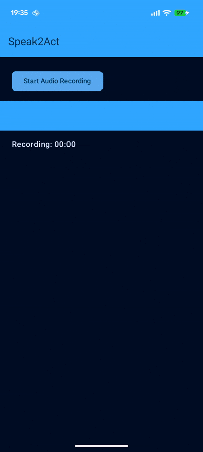

# Speak2Act
Android app that records speech and uses **Firebase AI Logic** (**Gemini**) to summarize spoken input into **structured transaction instructions**.
It showcases how voice input and serverless AI can be combined to build intelligent, low-latency mobile experiences.

---

## Why this exists

This project exists as a **practical reference implementation** for Android developers exploring **voice-driven workflows**, **Firebase AI Logic** and **LLM-powered features**.

---

## What it does

- Records user speech
- Transcribes and summarizes the intent
- Extracts structured transaction data (e.g. action, amount, recipient, purpose)
- Returns AI-generated instructions ready for further processing (e.g. payments, transactions)

---

## Tech stack

- **Android (Kotlin)**
- **Jetpack Compose** (UI & animations)
- **Firebase AI Logic**
- **Gemini models** (speech understanding & reasoning)
- **Coroutines & Flow**
- **Material 3**
- **Android Media APIs** (audio recording)

---

## How it works

### Flow

1. **User speaks** a natural-language command  
   _“Send 10 euros to Marija for the pizza.”_

2. **Audio is recorded** on the device  
   - Live waveform visualization
   - Permission-aware recording

3. **Audio is sent to Firebase AI Logic**
   - Gemini processes the speech
   - Intent is summarized
   - Parameters are extracted via structured output

4. **Structured result is returned**
   - **Action:** Request money
   - **Amount**: 10 francs
   - **From**: Maria
   - **Purpose**: Taxi bill
   
